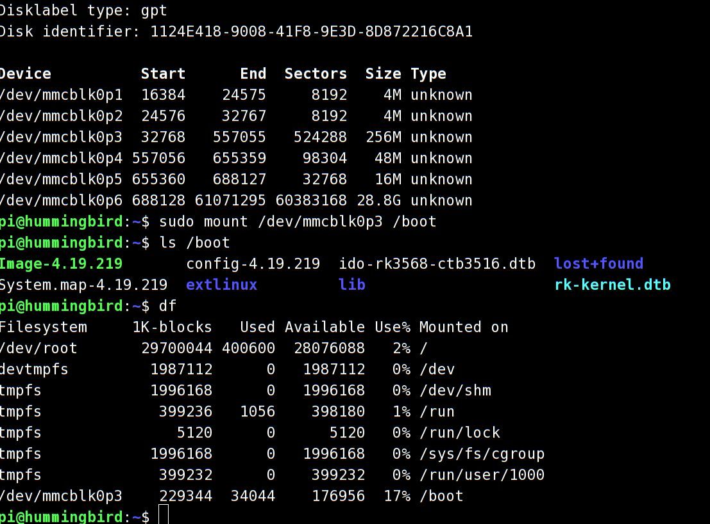

## Intro

添加RK3568的boot启动分区，这样通过修改boot文件系统上的kernel,dtb文件，就可以达到升级系统的目的。

根据Rockchip的文档SDK/docs/common/Uboot/Rockchip_Developer_Guide_uboot_nextdev_CN.pdf, SDK中提供的u-boot默认支持distro模式，可以很好的支持文件系统启动。

## RK3568 u-boot

u-boot使用CONFIG_BOOTCOMMAND，启动时会做设备检测,检测顺序为Android格式固件、RK FIT(Flat Image Tree)格式固件、RKP格式固件和文件系统格式固件。

```c
#define RKIMG_BOOTCOMMAND			\
	"boot_android ${devtype} ${devnum};"	\
	"boot_fit;"				\
	"bootrkp;"				\
	"run distro_bootcmd;"
#endif

```

将boot格式化为一个256MB的分区，拷贝kernel文件，dtb文件,并提供extlinux/extlinux.conf配置文件供u-boot读取。这样uboot启动时运行distro_bootcmd会自动检测到文件系统分区，并根据extlinux.conf文件加载设备树,启动kernel,加载rootfs分区，完成启动。

## 生成boot分区

原来的packed update.img的分配格式如SDK/device/rockchip/rk356x/parameter.txt文件所示.

```shell


FIRMWARE_VER: 1.0
MACHINE_MODEL: RK3568
MACHINE_ID: 007
MANUFACTURER: RK3568
MAGIC: 0x5041524B
ATAG: 0x00200800
MACHINE: 0xffffffff
CHECK_MASK: 0x80
PWR_HLD: 0,0,A,0,1
TYPE: GPT
CMDLINE: mtdparts=rk29xxnand:0x00002000@0x00004000(uboot),\
0x00002000@0x00006000(misc),\
0x00040000@0x00008000(boot:bootable),\
0x00018000@0x00048000(recovery),\
0x00008000@0x00060000(backup),\
-@0x00068000(rootfs:grow)
uuid:rootfs=614e0000-0000-4b53-8000-1d28000054a9

```

其中, CMDLINE的格式为 size@offset。boot部分为0x40000, 单位为sector, 512Btyes, 因此0x40000=2^18=256K, 256K*512=128MByte。

这样预留给boot分区的空间就是128MB.

## 生成boot image

这里借鉴了firefly RK3568 SDK的脚本文件。建立一个目录extboot/, 在目录下生成extlinux/extlinux.conf文件，将SDK/kernel/arch/arm64/boot/Image文件,SDK/kernel/arch/arm64/boot/dts/*.dtb文件拷贝进行。

使用mkfs.ext4生成image,其中包含了extboot/目录下的内容。

上述过程在build.sh脚本里添加函数模块，自动生成。

```shell

rm -rf ${EXTBOOT_DIR} && mkdir -p ${EXTBOOT_DIR}/extlinux

KERNEL_VERSION=$(cat $TOP_DIR/kernel/include/config/kernel.release)
echo "label rk-kernel.dtb linux-$KERNEL_VERSION" > $EXTBOOT_DIR/extlinux/extlinux.conf

cp ${TOP_DIR}/$RK_KERNEL_IMG $EXTBOOT_DIR/Image-$KERNEL_VERSION
echo -e "\tkernel /Image-$KERNEL_VERSION" >> $EXTBOOT_DIR/extlinux/extlinux.conf

cp ${TOP_DIR}/kernel/arch/${RK_ARCH}/boot/dts/rockchip/${RK_KERNEL_DTS}.dtb $EXTBOOT_DIR

ln -sf ${RK_KERNEL_DTS}.dtb $EXTBOOT_DIR/rk-kernel.dtb

echo -e "\tfdt /rk-kernel.dtb" >> $EXTBOOT_DIR/extlinux/extlinux.conf

cp ${TOP_DIR}/kernel/.config $EXTBOOT_DIR/config-$KERNEL_VERSION
cp ${TOP_DIR}/kernel/System.map $EXTBOOT_DIR/System.map-$KERNEL_VERSION

make ARCH=$RK_ARCH INSTALL_MOD_STRIP=1 INSTALL_MOD_PATH=$EXTBOOT_DIR modules_install

EXTBOOT_IMG_SIZE=128M

rm -rf $EXTBOOT_IMG && truncate -s $EXTBOOT_IMG_SIZE $EXTBOOT_IMG
fakeroot ${TOP_DIR}/device/rockchip/common/mkfs.ext4 -Fq -L "boot" -d $EXTBOOT_DIR $EXTBOOT_IMG

```


将生成的extboot.img作为新的boot.img打包进update.img


## 下载测试

通过启动时的debug console看到uboot检测分区格式的过程，最终uboot通过distro command找到emmc0的boot分区，并加载kernel文件，进入正常启动。耗时<1s。


```shell
U-Boot 2017.09(u-boot commit id: 0f621b0e434b6944de865b517687e096930885b9)(sdk version: rk356x_linux_release_20230523_v1.3.2d.xml)-g0f621b0e43-dirty #ruff (Jun 01 2023 - 09:44:43 +0800)

Model: Hummingbird Board
PreSerial: 2, raw, 0xfe660000
DRAM:  4 GiB
Sysmem: init
Relocation Offset: ed249000
Relocation fdt: eb9f86a0 - eb9fecd8
CR: M/C/I

...


Hit key to stop autoboot('CTRL+C'):  0 
ANDROID: reboot reason: "(none)"
optee api revision: 2.0
TEEC: Waring: Could not find security partition
Not AVB images, AVB skip
No valid android hdr
Android image load failed
Android boot failed, error -1.
## Booting FIT Image FIT: No fit blob
FIT: No FIT image

## Booting Rockchip Format Image
Could not find kernel partition, ret=-1
Card did not respond to voltage select!
mmc_init: -95, time 10
switch to partitions #0, OK
mmc0(part 0) is current device
Scanning mmc 0:3...
Found /extlinux/extlinux.conf
Retrieving file: /extlinux/extlinux.conf
=================begin===================
79 bytes read in 3 ms (25.4 KiB/s)
1:	rk-kernel.dtb linux-4.19.219
Retrieving file: /Image-4.19.219
=================begin===================
28135432 bytes read in 159 ms (168.8 MiB/s)
Retrieving file: /rk-kernel.dtb
=================begin===================
121632 bytes read in 5 ms (23.2 MiB/s)
Fdt Ramdisk skip relocation
## Flattened Device Tree blob at 0x08300000
   Booting using the fdt blob at 0x08300000
  'reserved-memory' ramoops@110000: addr=110000 size=f0000
   Using Device Tree in place at 0000000008300000, end 0000000008320b1f
No resource partition
No file: logo_kernel.bmp
** File not found logo.bmp **
Adding bank: 0x00200000 - 0x08400000 (size: 0x08200000)
Adding bank: 0x09400000 - 0xf0000000 (size: 0xe6c00000)
Adding bank: 0x1f0000000 - 0x200000000 (size: 0x10000000)
Total: 524.4 ms

Starting kernel ...


```


加载并查看boot分区




## 结束
